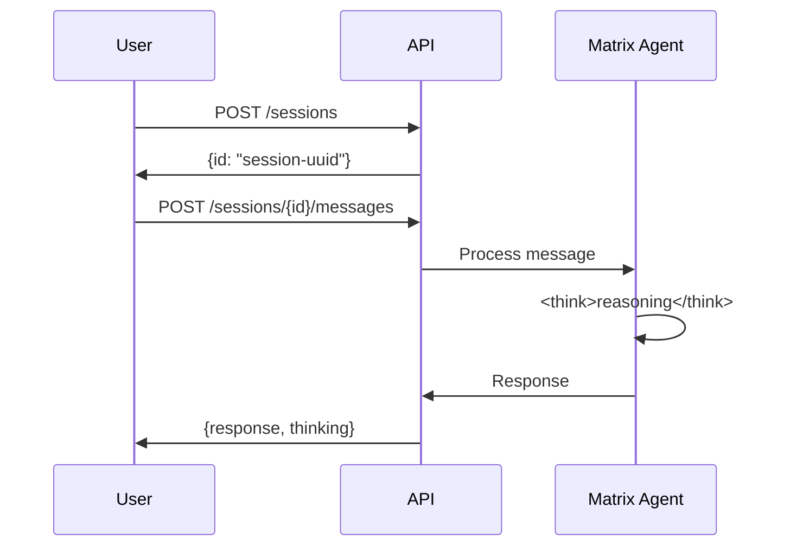

# Sessions

Sessions maintain conversation history with the Matrix Agent.

## Session Object

```json
{
  "id": "uuid",
  "name": "my-session",
  "created_at": "2024-01-01T00:00:00Z",
  "updated_at": "2024-01-01T00:00:00Z",
  "messages": []
}
```

## Message Object

```json
{
  "id": "uuid",
  "role": "user" | "assistant",
  "content": "Message content",
  "thinking": "Content inside <think> tags (if any)",
  "timestamp": "2024-01-01T00:00:00Z"
}
```

## Conversation Flow



## Preserving History

All messages including `<think>` content are preserved in session history, enabling:

- Context-aware responses
- Multi-turn conversations
- Reasoning transparency
