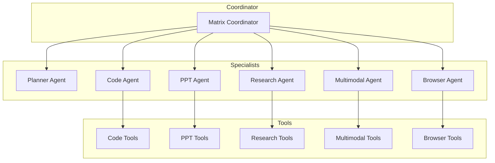

# Architecture Overview

## System Design

Matrix Agent follows a hierarchical multi-agent architecture:

## Components

### Coordinator

The Matrix Coordinator is the main entry point that:

- Receives user requests
- Analyzes task type using `<think>` reasoning
- Delegates to appropriate specialist agents
- Synthesizes final results

### Specialist Agents

| Agent | Purpose |
|-------|--------|
| Planner | Task decomposition for complex requests |
| Code | Full-stack web development |
| PPT | Presentation creation |
| Research | Information gathering and analysis |
| Multimodal | Media processing |
| Browser | Web automation |

### Tools

Each agent has access to `FunctionTool` wrapped Python functions that perform actual operations.

## Execution Flow

1. User sends request to Coordinator
2. Coordinator uses `<think>` to analyze
3. Simple task → Direct delegation
4. Complex task → Planner decomposes → Parallel execution
5. Results synthesized and returned
