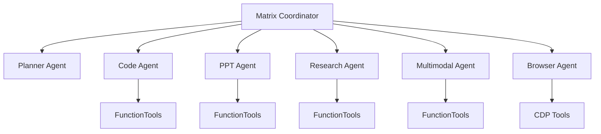

# Matrix Agent

**General-purpose AI Agent for complex, long-horizon tasks.**

[](https://railway.com/template/new?template=https://github.com/sheikhxodes/matrix-agent)

## Overview

Matrix Agent is a multi-agent system built with Google ADK (Agent Development Kit) that can:

- **Plan** complex tasks with multi-step reasoning
- **Delegate** to specialized sub-agents
- **Execute** parallel workflows for efficiency
- **Integrate** with MCP tools and external services

## Key Features

| Capability | Description |
|------------|-------------|
| **Code** | Full-stack web apps with Auth, Database, Stripe, E2E testing |
| **PPT** | Presentations with flexible layouts and PPTX export |
| **Research** | Web search, APIs, data analysis, reports |
| **Multimodal** | Image/audio/video understanding and generation |
| **Browser** | Automation via Chrome DevTools Protocol |

## Architecture



## Interleaved Thinking

Matrix Agent uses `<think>...</think>` tags to preserve reasoning:

```
<think>
1. User wants a SaaS dashboard
2. Need auth → Supabase
3. Need payments → Stripe
</think>

I'll build your SaaS dashboard...
```

## Quick Start

```bash
# Install
pip install -r requirements.txt

# Set API key
export GOOGLE_API_KEY="your-key"

# Run
uvicorn main:app --reload
```

## Links

- [GitHub Repository](https://github.com/sheikhxodes/matrix-agent)
- [Deploy on Railway](https://railway.com/template/new?template=https://github.com/sheikhxodes/matrix-agent)
- [Google ADK Documentation](https://google.github.io/adk-docs/)
