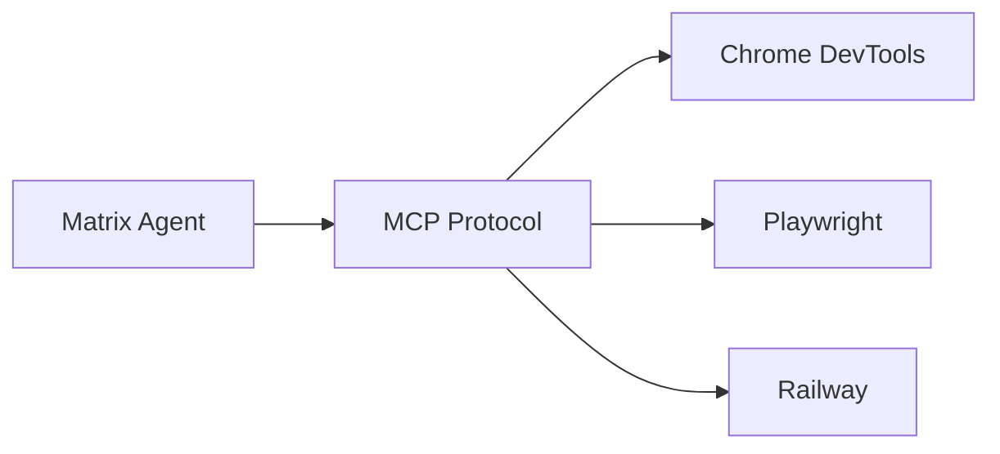

# MCP Integration

## What is MCP?

**Model Context Protocol (MCP)** is an open protocol that standardizes how applications provide context to LLMs.

Matrix Agent uses MCP to connect to external tools and services.

## How it Works



## Configuration

MCP servers are configured in `mcp.json`:

```json
{
  "mcpServers": {
    "server-name": {
      "command": "npx",
      "args": ["package-name"]
    }
  }
}
```

## Benefits

- **Standardized** - Common protocol for tool integration
- **Extensible** - Add any MCP-compatible server
- **Isolated** - Each server runs independently

## Related Protocols

| Protocol | Purpose |
|----------|--------|
| **MCP** | LLM ↔ Tools |
| **ADK** | Agent orchestration |
| **A2A** | Agent ↔ Agent (future) |
